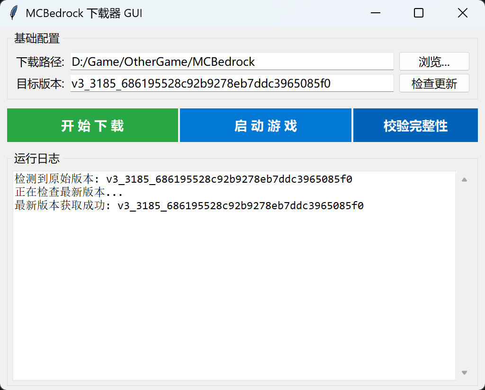

# mcbe_pccocos_launcher
mcbe基岩互通版启动器

## 功能
- 支持下载、更新、回退到某一版本
- 支持游戏内登录账号，无需发烧平台
- 支持校验文件完整性与修复资源
- 支持无 GUI 模式，直接启动游戏

## 界面展示

#### 关于`目标版本`:
- 默认会获取最新版本作为目标版本，用户也可以选择其他版本进行下载或回退
- 具体的版本列表请查看[这个项目](https://github.com/bubbles-wow/x19_pc_cocos_archive/releases)
- 如果你不清楚这是什么，请不要修改，使用`检查更新`按钮即可。
#### 关于`校验完整性`:
- 由于脱离发烧平台登录游戏需要修改游戏文件，因此总是会有一个文件是不完整的，请忽略。


## 配置说明
- 配置文件会在首次打开后自动生成。目前启动器只支持一个游戏目录的管理，如果需要管理多个游戏目录，需要手动切换游戏目录。
- 配置文件为`config.json`，位于启动器根目录下。配置文件包含以下字段：
    ```json
    {
        "appConfig": {
            "silentMode": false,
            "autoUpdate": false
        },
        "downloadConfig": {
            "isSSD": 1,
            "rateLimit": 0
        },
        "gameConfig": {
            "app_id": 81,
            "content_id": 569,
            "path": "D:/Game/OtherGame/MCBedrock",
            "running_process": "Minecraft.Windows.exe"
        }
    }
    ```
    1. `appConfig`: 启动器配置项
        - `silentMode`: 是否启用无 GUI 模式，启用后将直接启动游戏，不显示启动器界面。有更新时会弹窗确认是否更新。
        - `autoUpdate`: 是否启用自动更新，启用后在有更新时会自动进行下载。
    2. `downloadIpcConfig`: 下载器配置项
        - `isSSD`: 是否安装在SSD上，1表示是，0表示否
        - `rateLimit`: 下载速度限制，单位为KB/s，0表示不限制
    3. `gameConfig`: 游戏配置项（不要手动修改，会根据游戏目录进行识别）
        - `app_id`: 游戏应用ID，默认为81
        - `content_id`: 游戏内容ID，默认为569
        - `path`: 游戏安装路径，需要用户自行设置
        - `running_process`: 游戏运行时的进程名，默认为`Minecraft.Windows.exe`

## 免责声明
- 本项目仅供学习交流使用，请遵守开源协议
- 本项目属于第三方软件，使用可能会存在封号的风险，请明确你在使用前已经了解并接受这个风险
- 有问题请在 Issues 中提出，我有时间会查看并尝试解决

## 许可证
[GNU General Public License v3.0 (GPL-3.0)](LICENSE)

## 鸣谢
- [LobbyMaster](https://www.lobbymaster.cn/): 使用了部分文件实现无发烧平台登录功能
